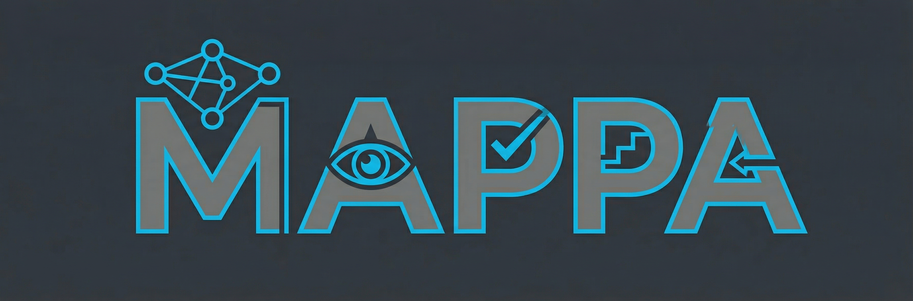

<p align="center">
  
</p>

<h1 align="center">Multi-Agent Reinforcement Training Interface</h1>

<p align="center">
  Training multi-agent LLM systems with external LLM coaches for process reward evaluation
</p>

---

## Overview

**MARTI** is a framework for training multi-agent LLM systems using reinforcement learning. Unlike traditional outcome-based rewards, MARTI uses external LLM judges (coaches) to provide per-action process rewards, enabling more granular feedback during training.

### Key Capabilities

| Feature | Description |
|---------|-------------|
| **Multi-Agent Orchestration** | Sequential agent workflows where each agent builds on previous outputs |
| **External LLM Coaching** | Gemini, GPT-4, or Claude as process reward evaluators with per-action feedback |
| **Code Execution** | Agents write and execute Python via SandboxFusion (secure, isolated) |
| **Distributed RL Training** | REINFORCE++ with DeepSpeed + Ray for multi-GPU training |
| **Flexible Evaluation** | Task-specific verifiers for math, code, and data science benchmarks |

---

## Installation

### Prerequisites

- Python 3.11+
- CUDA-compatible GPUs (minimum 2x 80GB A100/H100)
- UV package manager (recommended)

### Setup

1. **Clone and install:**
```bash
git clone <repository-url>
cd multiagent-coaching

uv venv --python 3.11
source .venv/bin/activate
uv pip install -r requirements_uv.txt
```

2. **Set up SandboxFusion (code execution):**
```bash
git clone https://github.com/bytedance/SandboxFusion.git ~/SandboxFusion
cd ~/SandboxFusion

# Main environment
conda create -n sandbox python=3.12 -y
conda activate sandbox
pip install poetry && poetry install

# Runtime environment
conda create -n sandbox-runtime python=3.11 -y
conda activate sandbox-runtime
pip install -r runtime/python/requirements.txt
```

3. **Configure LLM coach credentials:**
```bash
# For Vertex AI (Gemini)
export VERTEX_PROJECT=your-gcp-project-id
export GOOGLE_APPLICATION_CREDENTIALS=/path/to/credentials.json

# Or standard Gemini API
export GOOGLE_API_KEY=your-api-key
```

---

## Quick Start

### MathChat Training

Train a 3-agent system for math problem solving:

```bash
bash scripts/run_train_mathchat.sh Qwen/Qwen3-4B-Thinking-2507
```

**Workflow:** Problem Solver → Code Executor → Verifier
- Trains on AIME competition problems
- External coach (Gemini) evaluates each agent action
- Saves checkpoints to `./checkpoints/mathchat_coach/`

### DSBench Training

Train a 3-agent system for data science tasks:

```bash
bash scripts/run_train_dsbench.sh Qwen/Qwen3-4B-Thinking-2507
```

**Workflow:** Data Engineer → Modeler → Analyst
- Kaggle-style modeling tasks
- Agents write and execute code via SandboxFusion
- Evaluates on held-out tasks with ground truth metrics

### Direct CLI Usage

```bash
python -m marti.cli.commands.train \
    --config-name mathchat_with_coach \
    default_agent.pretrain=/path/to/model \
    use_wandb=your_api_key
```

---

## Codebase Structure

```
multiagent-coaching/
├── marti/                          # Core package
│   ├── agents/                     # Agent implementations
│   │   ├── base_agent.py          # Abstract Agent class
│   │   ├── multi_agent.py         # Multi-agent orchestration
│   │   └── math_agent.py          # Math-specific agents
│   │
│   ├── cli/                        # Command-line interface
│   │   ├── commands/train.py      # Main training entry point (Hydra)
│   │   └── configs/               # Hydra configuration files
│   │       ├── mathchat_with_coach.yaml
│   │       ├── dsbench_ds_pipeline.yaml
│   │       └── default.yaml
│   │
│   ├── controllers/                # Training orchestration
│   │   ├── base_controller.py     # Single-agent controller
│   │   └── multi_agent_controller.py
│   │
│   ├── models/                     # Model infrastructure
│   │   ├── actor.py               # Actor model wrapper
│   │   ├── vllm/                  # vLLM inference engines
│   │   └── ray_launcher.py        # Distributed training
│   │
│   ├── trainers/ppo/              # RL training
│   │   ├── trainer.py             # REINFORCE++/PPO trainer
│   │   ├── actor.py               # Policy training
│   │   └── critic.py              # Value function training
│   │
│   ├── verifiers/                  # Reward computation
│   │   ├── coach/external_coach.py # LLM-based process evaluator
│   │   ├── dsbench/               # Data science metrics
│   │   └── qwen/                  # Math answer verification
│   │
│   └── worlds/                     # Execution environments
│       ├── multi_agent_world_async.py
│       ├── workflows/             # Task-specific pipelines
│       │   ├── mathchat_workflow_with_coach.py
│       │   └── dsbench_workflow.py
│       └── tools/                 # Code execution, search
│
├── scripts/                        # Training scripts
│   ├── run_train_mathchat.sh
│   ├── run_train_dsbench.sh
│   └── setup_sandbox.sh
│
├── data/Bench/                     # Evaluation datasets
│   ├── AIME_1983_2024.json        # 933 AIME problems
│   ├── amc.json                   # AMC problems
│   └── dsbench_*.json             # Data science benchmarks
│
├── requirements_uv.txt            # Dependencies
└── setup_env.sh                   # Environment setup automation
```

---

## How It Works

### Training Loop

```
1. MultiAgentController initializes:
   ├─ Dataset loading (MATH, AIME, DSBench)
   ├─ Agent models (actor/critic/reference)
   ├─ vLLM engines (2 per agent)
   └─ MultiAgentWorldAsync environment

2. For each episode:
   ├─ Experience generation:
   │  ├─ Agent 1 generates output
   │  ├─ Coach evaluates Agent 1 → PROCESS_SCORE: X/10
   │  ├─ Agent 2 sees Agent 1's output + coach feedback
   │  ├─ Coach evaluates Agent 2
   │  └─ Agent 3 sees all outputs, produces final answer
   │
   └─ REINFORCE++ training:
      ├─ Compute advantages (global batch normalization)
      ├─ DeepSpeed backpropagation
      └─ Checkpoint saving + metric logging
```

### Coach Evaluation

The external LLM coach provides process rewards (0-10 scale) for each agent action:

```
PROCESS_SCORE: 8
REASONING: The code correctly implements the solution approach...
```

This enables:
- **Dense feedback**: Every action receives a reward, not just final outcomes
- **Interpretable training**: Coach reasoning explains what makes actions good/bad
- **Cross-model learning**: Train smaller models with feedback from larger coaches

### Agent Communication

- **Sequential execution**: Each agent sees all previous agents' outputs
- **Spatial predecessors**: Other agents at same timestep
- **Temporal predecessors**: Same agent's history across turns
- **Thinking models**: Support for `<think>` tags with `is_reasoning_model=true`

---

## Configuration

Training configs use [Hydra](https://hydra.cc/) and are located in `marti/cli/configs/`. Each pipeline has its own YAML config and shell script.

---

### MathChat Pipeline

**Config:** `marti/cli/configs/mathchat_with_coach.yaml`
**Script:** `scripts/run_train_mathchat.sh`

#### Agent Workflow

```
Problem Solver → Code Executor → Verifier
```

| Agent | Role | Max Turns |
|-------|------|-----------|
| Problem Solver | Reasons through the problem step-by-step | 1 |
| Code Executor | Writes and executes Python code to verify/compute | 2 |
| Verifier | Synthesizes outputs and provides final answer | 1 |

#### Configuration

```yaml
# Workflow
workflow_func_path: "marti/worlds/workflows/mathchat_workflow_with_coach.py"

# Coach
workflow_args:
  coach_model: "gemini-2.5-flash"
  use_vertex_ai: true
  coder_max_turns: 2

# Agents
agents:
  - agent_problem_solver
  - agent_code_executor
  - agent_verifier
```

#### Training Parameters (from shell script)

| Parameter | Value | Description |
|-----------|-------|-------------|
| `advantage_estimator` | reinforce_plus_plus | REINFORCE++ algorithm |
| `n_samples_per_prompt` | 2 | Samples per prompt |
| `rollout_batch_size` | 32 | Prompts per batch |
| `train_batch_size` | 16 | Samples per training step |
| `num_episodes` | 8 | Training episodes |
| `vllm_num_engines` | 2 | vLLM engines per agent |
| `prompt_max_len` | 24576 | 24K input context |
| `generate_max_len` | 4096 | 4K generation length |

#### Dataset

- **Training:** 512 problems randomly sampled from AIME_1983_2024.json (933 total)
- **Evaluation:** aime_eval_32.json (32) + amc_eval_32.json (32)

---

### DSBench Pipeline

**Config:** `marti/cli/configs/dsbench_ds_pipeline.yaml`
**Script:** `scripts/run_train_dsbench.sh`

#### Agent Workflow

```
Data Engineer → Modeler → Analyst
```

| Agent | Role | Max Turns | Required Outputs |
|-------|------|-----------|------------------|
| Data Engineer | EDA, preprocessing, feature engineering | 4 | `X_train.pkl`, `y_train.pkl`, `X_test.pkl` |
| Modeler | Algorithm selection, training, tuning | 4 | `model.pkl` |
| Analyst | Prediction generation, format verification | 4 | `submission.csv` |

#### Configuration

```yaml
# Workflow
workflow_func_path: "marti/worlds/workflows/dsbench_workflow.py"

# Coach
workflow_args:
  coach_model: "gemini-2.5-pro"
  use_vertex_ai: true
  data_engineer_max_turns: 4
  modeler_max_turns: 4
  analyst_max_turns: 4

# Agents
agents:
  - agent_data_engineer
  - agent_modeler
  - agent_analyst

# Stratified sampling (maintains classification/regression balance)
default_agent:
  stratified_sampling: true
  stratify_key: "data_type"
```

#### Training Parameters (from shell script)

| Parameter | Value | Description |
|-----------|-------|-------------|
| `advantage_estimator` | reinforce_plus_plus | REINFORCE++ algorithm |
| `n_samples_per_prompt` | 2 | Samples per prompt |
| `rollout_batch_size` | 16 | Prompts per batch |
| `train_batch_size` | 16 | Samples per training step |
| `num_episodes` | 30 | Training episodes |
| `vllm_num_engines` | 2 | vLLM engines per agent |
| `prompt_max_len` | 24576 | 24K input context |
| `generate_max_len` | 16384 | 16K generation (for long code) |
| `coach_model` | gemini-2.5-pro | Gemini 2.5 Pro (1M context) |

#### Dataset

- **Training:** dsbench_modeling_train.json (64 Kaggle-style modeling tasks)
- **Evaluation:** dsbench_modeling_eval.json (8 held-out tasks)
- **Split:** Stratified ~47% classification, ~53% regression

---

### Command-Line Overrides

Any config parameter can be overridden via CLI:

```bash
# MathChat
python -m marti.cli.commands.train \
    --config-name mathchat_with_coach \
    default_agent.pretrain=/path/to/model \
    workflow_args.coach_model="gemini-2.5-flash"

# DSBench
python -m marti.cli.commands.train \
    --config-name dsbench_ds_pipeline \
    default_agent.pretrain=/path/to/model \
    workflow_args.coach_model="gemini-2.5-pro"
```

---

## Hardware Requirements

| Configuration | GPUs | Use Case |
|--------------|------|----------|
| Minimum | 2x 80GB | Single-agent training |
| Recommended | 4-8x 80GB | Multi-agent training |

### Memory Management

The framework includes optimizations for limited GPU memory:

- `colocate_all_models=true`: Share GPUs between models
- `vllm_gpu_memory_utilization=0.6-0.7`: Leave 30-40% for training
- `vllm_enable_sleep=true`: vLLM releases memory during backprop
- `gradient_checkpointing=true`: Trade compute for memory
- `zero_stage=3`: Maximum DeepSpeed memory compression

---

## Logging

| Platform | Configuration |
|----------|---------------|
| Weights & Biases | `use_wandb=<API_KEY>` |
| TensorBoard | Logs saved to `logs/` |
| Weave (LLM tracing) | `use_weave=true` |

---

## Key Dependencies

- **LLM Inference**: vLLM 0.8.5, flash-attn 2.7.3, transformers 4.52.1
- **Training**: PyTorch 2.6.0, DeepSpeed 0.16.8, Ray 2.43.0
- **Configuration**: Hydra 1.3.2
- **LLM APIs**: google-genai, openai 2.6.1
- **Tools**: MCP 1.20.0 (Model Context Protocol)

See `requirements_uv.txt` for exact tested versions.

---

## Contributing

1. Fork the repository
2. Create a feature branch
3. Make your changes
4. Add tests if applicable
5. Submit a pull request

---

## License

This project is licensed under the MIT License - see the LICENSE file for details.

---

## Acknowledgments

- Built on the [MARTI](https://github.com/TsinghuaC3I/MARTI) multi-agent reinforcement learning framework
- Code execution powered by [SandboxFusion](https://github.com/bytedance/SandboxFusion)
- Distributed training with [DeepSpeed](https://github.com/microsoft/DeepSpeed) and [Ray](https://github.com/ray-project/ray)
- LLM inference via [vLLM](https://github.com/vllm-project/vllm)

---

## Support

For questions and support, please open an issue on the GitHub repository.

---

## Citation

To cite this work, please use the following BibTeX entry:

```bibtex
@misc{multiagent-coaching2025,
      title={Multi-Agent Reinforcement Training with External LLM Coaches},
      year={2025},
      eprint={2601.23228},
      archivePrefix={arXiv},
      primaryClass={cs.LG},
      url={https://arxiv.org/abs/2601.23228},
}
```
